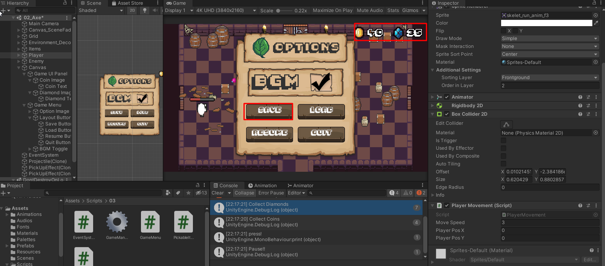
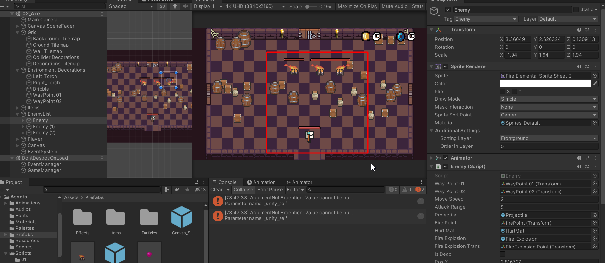

# Unity数据系统学习


我们需要使用数据系统来保存和读取相关的信息，Unity中有四种数据存取方式：**PlayerPrefs，二进制序列化数据，JSON数据，XML文档数据**。
本文是作者针对数据系统的学习，主要参考了视频如下[盘点四种Unity中保存读取数据方法的优缺点](https://www.bilibili.com/video/BV1H7411b7bM),这里感谢原作者BeaverJoe的教学


## PlayerPrefs

### 定义

PlayerPrefs是player preferences的简写，PlayerPrefs是Unity内置的一个静态类，可以用于**存储读取**一些简单的数据类型，他是一种特殊的**缓存系统**用来储存读取游戏中的简单设置和数据。

类似Redis，PlayerPrefs通过键值对进行数据的存储和读取。PlayerPrefs可以保证我们在Unity工程处于运行阶段时，一直保存现有的数据。

PlayerPref的实际应用非常简单，他就如同一个长期存在的Map，或者Dictionary字典类一样，通过如下代码就可以实现角色相关信息的保存了。

### 实战

我们现在可以通过保存按钮获得角色的金币，钻石，位置等信息，通过Load读取上次保存的信息了。



```c#
    public void PlayerSave() {
        PlayerPrefs.SetInt("coins", GameManager.instance.coin);
        PlayerPrefs.SetInt("diamond", GameManager.instance.diamond);
        PlayerPrefs.SetFloat("PosX", playerMovement.transform.position.x);
        PlayerPrefs.SetFloat("PosY", playerMovement.transform.position.y);
        Debug.Log("Save Success!!");
    }

    public void PlayerLoad()
    {
        GameManager.instance.coin = PlayerPrefs.GetInt("coins");
        GameManager.instance.diamond = PlayerPrefs.GetInt("diamond");
        playerMovement.transform.position = new Vector2(PlayerPrefs.GetFloat("PosX"), PlayerPrefs.GetFloat("PosY"));
        Debug.Log("Load Success!!");
    }
```

### 总结

- **原理：**以key-value【键值对】的形式将数据保存在本地，然后在代码中可以写入、读取、更新数据
- **优势：**储存一些简单的数据，游戏选项设置，用户登陆信息等
- **缺点：**对于大量数据的保存读取会十分乏力（无数的key值）


## 二进制序列化（Serialization）

### 定义

序列化是将**对象的状态信息**转换为**Unity可以存储的形式**的自动化处理过程，他的主要目的是让我们的自定义对象得以保存。

在Unity引擎中，许多功能会自动触发序列化过程，比如文件的保存读取，包括Scene、Asset、AssetBundle等。

序列化中最重要的三个类分别为：**File，FileStream，BinaryFormat**。

- **File:** C#中处理文件的静态类（**新建，复制，删除**）
- **FileStream:**  FileStream类将文件的内容以字节流的形式呈现出来进行操作（**读取，写入**）
- **BinaryFormat：**序列化（对象---->二进制）及反序列化（二进制---->对象）

### 实现

我们的主要实现方式就是新建一个专门用于保存各种信息的**对象（SerializedFile）**，将该对象序列化成二进制文件保存在磁盘上，在读取该文件通过反序列化成对象更新当前的信息。

我们通过保存敌人的状态信息，可以使敌人重置到保存点的位置，即使被销毁也可以重建。



```C#
[System.Serializable] //这里很重要必须加上！！！
public class SerializedFile
{
    public int coinNum;
    public int diamondNum;
    public float PosX;
    public float PosY;

    public List<float> enemyPosX;
    public List<float> enemyPosY;
    public List<bool> isDead;

    public SerializedFile(int _coinNum,int _diamonNum, float _posx,float _posy, List<float> _enemyPosX, List<float> _enemyPosY, List<bool> _isDead) {
        coinNum = _coinNum;
        diamondNum = _diamonNum;
        PosX = _posx;
        PosY = _posy;
        enemyPosX = _enemyPosX;
        enemyPosY = _enemyPosY;
        isDead = _isDead;
    }
}
```

```c#
 //序列化数据保存
 private void SerializeSave() {
	...//构建serializedFile对象
    BinaryFormatter binaryFormatter = new BinaryFormatter();
    FileStream fileStream = File.Create(Application.dataPath + "/Data.txt");
    binaryFormatter.Serialize(fileStream, serializedFile);
    fileStream.Close();
}

private void SerializeLoad(){
   if (File.Exists(Application.dataPath + "/Data.txt"))
   {
     BinaryFormatter binaryFormatter = new BinaryFormatter();
     FileStream fileStream = File.Open(Application.dataPath + "/Data.txt",FileMode.Open);
     SerializedFile sF = binaryFormatter.Deserialize(fileStream) as SerializedFile;
	
     ...//还原游戏对象的值


     ...//还原敌人的值

   }else {
      Debug.Log("The file didn't Exist!!!");
   }
}
```

### 总结

序列化的方式有许多种，这里用的是最简单的binaryFormatter二进制进行序列化，他的问题在于他序列化得到的二进制文件不存在任何的可读性，且他**无法序列化自定义的类**，比如我在seralizedfile中声明一个unity的vector2类型他便无法进行序列化。


## JSON

### 定义

JSON是一种轻量级的数据交换格式，它具备自我描述性，易于理解，它主要由一系列的键值对来组成对象。

```Json
｛
	"coinsNum":10,            //int
	"diamondsNum":25,		  //int
	"playerPositionX":-3.27,  //float
	"playerPositionY":4.42,   //float
	"isDead":true,			  //bool
	"name":hero,		      //string
	"enemy":["0","1","2"],    //array
｝
```

JSON是文本格式，本质是一个**字符串String类型**。

### 实现（JsonUtility）

实际效果与二进制相同这里不重复了。代码如下：

```C#
    private void JsonSave() {
        SerializedFile serializedFile = CreateCurrentState();
        string Json = JsonUtility.ToJson(serializedFile);
        StreamWriter sw = new StreamWriter(Application.dataPath + "Data.json");
        sw.Write(Json);
        sw.Close();
    }

    private void JsonLoad() {
        if (File.Exists(Application.dataPath + "Data.json")) {
            StreamReader sr = new StreamReader(Application.dataPath + "Data.json");
            string Json = sr.ReadToEnd();
            sr.Close();
            SerializedFile serializedFile = JsonUtility.FromJson<SerializedFile>(Json);
            ReturnState(serializedFile);
        }
        else {
            Debug.Log("File didn't Exsit!!");
        }
    }
```

也比较易于理解，本质就是将对象转变为JSON字符串后通过文件流保存到本地，我们看一下本地的JSON文件

```json
{
    "coinNum":0,
    "diamondNum":0,
    "PosX":0,
    "PosY":-3.859999895095825,
    "enemyPosX":[
        3.5580151081085207,
        -3.064706325531006,
        2.659546375274658
    ],
    "enemyPosY":[
        3,
        3.0224366188049316,
        2.9999356269836426
    ],
    "isDead":[
        false,
        false,
        false
    ]
}
```

### 总结

- **JSON概念：**JSON(JavaScript Object Notation)一种轻量级的数据交换格式，具有良好的可读和便于快速编写的特性。可在不同平台之间进行数据交换。JSON采用兼容性很高的、完全独立于语言文本格式，同时也具备类似于C语言的习惯体系的行为。这些特性使JSON成为理想的数据交换语言。
- **JSON结构：**JSON语法是javaScript语法的子集，javaScript用[]中括号来表示数组，用{}大括号来表示对象，JSON亦是如此。
- **JSON优势：**解析速度快，数据格式比较简单，易于读写，格式都是压缩的，占用带宽小。支持多种语言，便于服务器端的解析。因为JSON格式能直接为服务器端代码使用，大大简化了服务器端和客户端的代码开发量，且完成任务不变，并且易于维护。
- **JSON缺点：**当对象的成员变量剧烈增长时，他仍然不具备好的可读性。

**注意：**  **FileStream**读取的是字节数组，更适合读二进制文件。**StreamReader，StreamWriter**会自动帮我们处理编码格式，因此更适合处理文本。


## XML

### 定义

**xml可扩展标记语言**，被设计用来结构化的存储和传输数据信息。由于计算机中常常使用不兼容的格式类存储数据，对开发人员而言，在不兼容系统之间交换数据是非常消耗时间的。

XML与HTML类似，他以文本格式保存。

### 实现

XML文件具备一定的可读性，但是他在代码中的实现也比较复杂，建议需要进行封装来简化XML的创建过程。

```c#
  private void XMLSave() {
        SerializedFile serializedFile = CreateCurrentState();
        XmlDocument xmlDocument = new XmlDocument();
        //xml格式将会有层次关系，我们通过root和AppendChild来进行对象的组合

        XmlElement root = xmlDocument.CreateElement("SerializedFile");
        root.SetAttribute("FileName", "DataSaving");

        XmlElement coinNumElement = xmlDocument.CreateElement("CoinNum");
        coinNumElement.InnerText = serializedFile.coinNum.ToString();
        root.AppendChild(coinNumElement);

        XmlElement diamondNumElement = xmlDocument.CreateElement("DiamondNum");
        diamondNumElement.InnerText = serializedFile.diamondNum.ToString();
        root.AppendChild(diamondNumElement);

        XmlElement PosXElement = xmlDocument.CreateElement("PosX");
        PosXElement.InnerText = serializedFile.PosX.ToString();
        root.AppendChild(PosXElement);

        XmlElement PosYElement = xmlDocument.CreateElement("PosY");
        PosYElement.InnerText = serializedFile.PosY.ToString();
        root.AppendChild(PosYElement);

        XmlElement Enemyelement, enemyposx, enemyposy, isdead;
        for (int i = 0; i < serializedFile.enemyPosX.Count; i++) {
            Enemyelement = xmlDocument.CreateElement("Enemy");
            enemyposx = xmlDocument.CreateElement("positionX");
            enemyposy = xmlDocument.CreateElement("positionY");
            isdead = xmlDocument.CreateElement("IsDead");

            enemyposx.InnerText = serializedFile.enemyPosX[i].ToString();
            enemyposy.InnerText = serializedFile.enemyPosY[i].ToString();
            isdead.InnerText = serializedFile.isDead[i].ToString();

            Enemyelement.AppendChild(enemyposx);
            Enemyelement.AppendChild(enemyposy);
            Enemyelement.AppendChild(isdead);

            root.AppendChild(Enemyelement);
        }

        xmlDocument.AppendChild(root);

        xmlDocument.Save(Application.dataPath + "/Data.xml");
    }

    private void XMLLoad() {
        if (File.Exists(Application.dataPath + "/Data.xml"))
        {
            XmlDocument xmlDocument = new XmlDocument();
            xmlDocument.Load(Application.dataPath + "/Data.xml");

            XmlNodeList coinNum = xmlDocument.GetElementsByTagName("CoinNum");
            int coinNumCount = int.Parse(coinNum[0].InnerText);

            XmlNodeList diamondNum = xmlDocument.GetElementsByTagName("DiamondNum");
            int diamondNumCount = int.Parse(diamondNum[0].InnerText);

            XmlNodeList PosX = xmlDocument.GetElementsByTagName("PosX");
            float positionX = float.Parse(PosX[0].InnerText);

            XmlNodeList PosY = xmlDocument.GetElementsByTagName("PosY");
            float positionY = float.Parse(PosY[0].InnerText);


            List<float> enemyPosX = new List<float>();
            List<float> enemyPosY =  new List<float>();
            List<bool> isDead = new List<bool>();
            XmlNodeList Enemy = xmlDocument.GetElementsByTagName("Enemy");
            foreach (var item in Enemy)
            {
                XmlNodeList enemyposx = xmlDocument.GetElementsByTagName("positionX");
                XmlNodeList enemyposy = xmlDocument.GetElementsByTagName("positionY");
                XmlNodeList isdead = xmlDocument.GetElementsByTagName("IsDead");
                enemyPosX.Add(float.Parse(enemyposx[0].InnerText));
                enemyPosY.Add(float.Parse(enemyposy[0].InnerText));
                isDead.Add(bool.Parse(isdead[0].InnerText));
            }

            SerializedFile serializedFile = new SerializedFile(coinNumCount,diamondNumCount,positionX,positionY,enemyPosX,enemyPosY,isDead);
            ReturnState(serializedFile);
        }
        else {
            Debug.Log("File didn't Exist!!");
        }
    }
```

我们需要对照一下xml文件来理解root，AppendChild的含义,所有成员变量均是root SerializedFile的孩子，其中的Enemy对象由于有多个，再次封装一层他的位置与死亡信息成员变量是他的孩子，因此这种树型的结构是具备较好的可读性的。

```XML
<SerializedFile FileName="DataSaving">
  <CoinNum>10</CoinNum>
  <DiamondNum>10</DiamondNum>
  <PosX>-6.895652</PosX>
  <PosY>-1.218627</PosY>
  <Enemy>
    <positionX>-2.69971</positionX>
    <positionY>3</positionY>
    <IsDead>False</IsDead>
  </Enemy>
  <Enemy>
    <positionX>1.577351</positionX>
    <positionY>3.00003</positionY>
    <IsDead>False</IsDead>
  </Enemy>
  <Enemy>
    <positionX>-1.851341</positionX>
    <positionY>3</positionY>
    <IsDead>False</IsDead>
  </Enemy>
</SerializedFile>
```

### 总结

- XML（可扩展标记语言）被设计用来**“结构化”传输和存储数据**，携带数据和交换数据 
- XML文档即文本文件，按照XML语法规则书写，**本质也是String**
- 文档必须包含根元素。该元素是所有其他元素的父元素！ **XML文档中的元素形成了一颗文档树**。这棵树丛根部开始，并扩展 （所有元素都可拥有子元素）
- XML非常**适合 Web 传输**，提供了统一的方法来描述和交换独立于应用程序或供应商的结构化数据
  容易与其他系统进行远程交互，数据共享比较方便


## 四类数据方式总结（PlayerPref，Binary，Json，XML）

- **PlayerPref：**PlayerPrefs更适合保存一些简单的变量和选项设置，或者用户的简单信息，图片等资源
- **Binary：**序列化二进制的缺点很明显：可读性为零，兼容性不客观
- **Json（目前看来更多的使用）：**
  - **优点：**解析速度快，数据格式比较简单，易于读写，格式都是压缩的，占用带宽小，支持多种语言，便于服务器端的解析，因为JSON格式能直接为服务器端代码使用，大大简化了服务器端和客户端的代码开发量，且完成任务不变，并且易于维护。
  - **缺点：**目前在Web Service中推广还属于初级阶段
- **XML（可以在某些统一配置中使用）：**
  - **优点：**格式统一，符合标准，容易与其他系统进行远程交互，数据共享比较方便。
  - **缺点：**XML文件庞大，文件格式复杂，传输占带宽，服务器端和客户端都需要花费大量代码来解析XML，导致服务器端和客户端代码变得异常复杂且不易维护，客户端不同浏览器之间解析XML的方式不一致，需要重复编写很多代码
